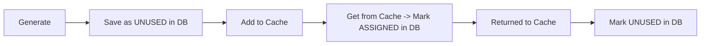
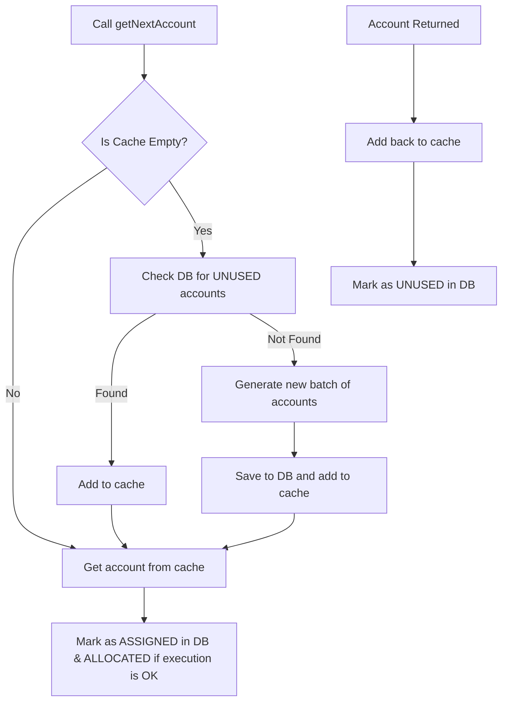

# 🏦 Account Generation System – Full Design Overview

This document details the architecture, design rationale, and operational flow of the `AccountGeneratorService` and its supporting components. It explains how the system ensures **account uniqueness**, handles **collisions**, manages **caching**, and provides a safe, scalable solution for account number generation.

---

## 📦 Components Overview

### 1. `AccountGeneratorService`
- Central service responsible for:
    - Generating unique account numbers
    - Prefetching and caching accounts
    - Marking accounts as **ASSIGNED** or **UNUSED** in the database

### 2. `AccountCache`
- In-memory queue used to reduce DB hits and deliver fast account allocation
- Interface defines:
    - `isCacheEmpty()`
    - `addToCache(String accountNumber)`
    - `getFromCache()`

### 3. `AccountRepository`
- Spring Data JPA repository responsible for:
    - Saving new accounts
    - Retrieving UNUSED accounts
    - Marking accounts as ASSIGNED
    - Restoring returned accounts to UNUSED

---

## 🔄 Account Lifecycle



# 🔢 Account Number Format

**Format:**  
`"2200"` + `[6-digit timestamp since custom epoch]` + `[2-digit sequence]`  
**Example:** `220012345601`

| Component | Description |
|----------|-------------|
| `2200`   | Static prefix (e.g., product/bank code) |
| Timestamp | 6-digit counter from `System.currentTimeMillis() - EPOCH` |
| Sequence  | 2-digit atomic sequence (range: 00–99) |

---

## ✅ Ensuring Uniqueness & Avoiding Collisions

| Risk                        | Mitigation Strategy                                  |
|-----------------------------|------------------------------------------------------|
| Race condition              | `synchronized` method + atomic sequence counter      |
| Sequence wraparound         | Sequence is per timestamp, resets every millisecond |
| Multi-thread access         | Service and generator methods are `synchronized`     |
| Duplicate in DB             | Catch + log error, discard duplicate                 |
| Restarting the application  | DB ensures persistent state, uniqueness across runs  |

---

## 💡 Account Generation Logic

- Uses a **custom epoch** to create shorter, manageable timestamp ranges  
- `AtomicInteger` ensures the sequence is thread-safe and always increments per call  
- `generateAccountNumber()` is `synchronized` to ensure only one thread runs it at a time  

```java
public static synchronized String generateAccountNumber() {
    long timestamp = (System.currentTimeMillis() - EPOCH) % 1_000_000; // 6-digit timestamp
    int seq = sequence.updateAndGet(n -> (n >= MAX_SEQUENCE) ? 0 : n + 1); // 2-digit sequence
    return String.format("2200%06d%02d", timestamp, seq);
}
```
## 🚫 How Duplicate Accounts Are Avoided

### Strategy:
- Synchronize the generator method to ensure only **one thread** at a time
- Limit to **100 unique accounts per millisecond** (`00–99`)
- **Timestamp** ensures uniqueness across time
- On save:
  - If the account number already exists → **catch & log**, then **discard** the account

```java
try {
    accountRepository.save(account);
    accountCache.addToCache(accountNumber);
} catch (RuntimeException exception) {
    log.error("Attempting to generate and cache an existing account number, dropping account {}", accountNumber);
}
```

## 🧠 Thread Safety

All major methods are `synchronized`:

- `getNextAccount()`
- `returnAccount()`
- `generateAccountNumber()`

### This prevents race conditions in:
- **Sequence increment**
- **Cache access**

Additionally:
- Uses `AtomicInteger` for **non-blocking**, thread-safe sequence handling.

---

## 🔄 Batch Prefetching

### Controlled via configuration:

```yaml
account:
  cache:
    batch-size: 10
```
## 🔁 Cache Usage Flow

1. Call `getNextAccount()`
2. If cache is **empty**:
   - Check the database for `UNUSED` accounts
   - If none are found → **generate** a new batch of accounts
3. Retrieve an account number from the cache
4. Mark the retrieved account as **ASSIGNED** in the database
5. If an account is **returned**:
   - Add it back to the cache
   - Mark it as **UNUSED** in the database

## 🔁 Cache Usage Flow

1. Call `getNextAccount()`
2. If cache is **empty**:
    - Check the database for `UNUSED` accounts
    - If none are found → **generate** a new batch of accounts
3. Retrieve an account number from the cache
4. Mark the retrieved account as **ASSIGNED** in the database
5. If an account is **returned**:
    - Add it back to the cache
    - Mark it as **UNUSED** in the database

### 📊 Flow Diagram (Mermaid)

